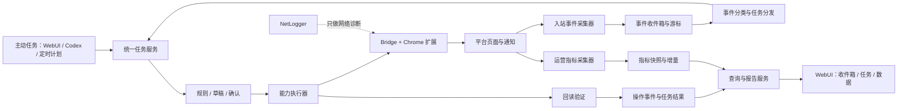

# 自动多账号小红书运营系统：任务闭环与数据回收架构

状态：`APPROVED`

适用范围：私信、主加、主页装修、拉群、被动回复，以及持续运营数据回收。

本文先确定产品和技术架构。代码完成、自动化测试通过和真实浏览器验收是三个不同阶段；在真实验收完成前，不把任何新增对外操作标记为可用。

## 1. 需求解释与待确认项

根据截图，待开发范围为：


| 截图用语   | 本文暂定解释                                       | 当前项目状态                                 |
| ---------- | -------------------------------------------------- | -------------------------------------------- |
| 私信       | 首次私信或继续已有会话；单批最多 10 个收件人       | Agent/CLI 执行链和自动化测试已完成，真实发送待验收 |
| 主加       | 主动关注一个博主                                   | Agent/CLI 自动化链和真实关注均已验收         |
| 装修       | 修改账号头像、昵称、简介资料、背景图等公开主页资料 | 未实现                                       |
| 拉群       | 创建新群并邀请用户，同时支持向已有群邀请用户       | 未实现                                       |
| 回复       | 发现自己笔记下的新评论，生成被动任务并回复         | 评论采集、事件、智能草稿和人工确认链已测试；后台规则执行与实机待验收 |
| 数据一直做 | 持续回收任务执行记录和运营指标                     | 指标采集、时间快照、历史和增量 API 已测试；调度与报告待完成 |

以下三项语义已于 2026-08-19 确认：

1. “主加”是否就是主动关注博主；是的
2. “装修”是否指账号公开主页资料；是的
3. “拉群”同时包含创建新群并邀请用户，以及向已有群邀请用户。

其余架构不依赖这三个答案，可以先建设共用底座。

## 2. 产品定义

“数据回收”由两个业务域组成。

### 2.1 任务与事件闭环

主动任务和被动任务共用一套任务模型。

主动任务来源：

- 用户在 WebUI 创建；
- Codex 创建；
- 用户已配置的定时计划触发。

被动任务来源：

- 自己笔记下出现新评论；
- 收到新的 @、关注或其他运营通知；
- 后续开放私信收件箱时收到新消息；
- 数据采集任务发现需要人工处理的异常。

平台上的“新评论”首先是一个入站事件，不直接等于回复任务。事件经过保存和去重后，再按规则转成任务。

```text
发现平台事件
→ 保存原始业务事件
→ 按平台事件 ID 去重
→ 分类并匹配账号规则
→ 创建被动任务
→ 生成草稿或等待人工填写
→ 人工确认或命中已启用的自动规则
→ 执行动作
→ 回读平台状态
→ 保存执行结果
```

### 2.2 运营数据回收

持续采集自己账号和自己笔记的运营指标，形成时间序列，而不是只读取一次当前页面。

首期指标范围：

- 账号：粉丝数、关注数、获赞与收藏数、公开笔记数；
- 笔记：点赞、收藏、评论、分享，以及页面或创作中心能够稳定读取的曝光和阅读数据；
- 任务：计划数量、实际执行数量、成功、失败、阻塞、结果未知；
- 回复：新评论数量、已处理、待处理、转人工、回复成功和失败。

首期输出：

- 当前快照；
- 与上一次快照相比的增量；
- 单篇笔记时间线；
- 账号日报和周报的结构化数据；
- WebUI 数据页需要的聚合接口。

## 3. 总体架构



架构规则：

- 所有主动和被动动作都必须先成为任务，不允许采集器直接发送内容；
- 读取平台事件与指标是只读采集，发送私信、关注、修改资料、邀请入群和回复是独立写操作；
- 同一账号的写操作继续串行，不同账号可以并行；
- 每次写操作都保留目标、输入、开始结束时间、结果和回读证据；
- NetLogger 是诊断工具，不作为任务数据库或运营指标数据库；
- 去重优先使用平台事件 ID、评论 ID、消息 ID、账号槽位和自然唯一约束。

## 4. 数据存储方案

### 4.1 选择 SQLite 作为持续数据底座

当前 `product-state.json` 继续兼容现有任务、草稿、确认和事件。新增的持续事件与指标数据使用本地 SQLite，原因是：

- 需要按账号、时间、任务状态和内容查询；
- 需要自然唯一约束，防止同一评论重复生成任务；
- 指标快照会长期追加，JSON 文件不适合持续增长；
- 本地 SQLite 不需要额外部署数据库服务。

默认文件：

```text
%USERPROFILE%\.xhs\auto-xhs\operations.db
```

先增加存储接口，再逐步把现有最小任务记录迁入同一数据库；不在第一步做一次性大迁移。

### 4.2 核心数据表

#### `inbound_events`

保存平台产生的业务事件。

关键字段：

```text
event_id
account_slot
event_type
platform_event_id
object_type
object_id
actor_user_id
occurred_at
discovered_at
payload_json
classification
handling_state
created_task_id
```

自然唯一约束：`account_slot + event_type + platform_event_id`。

#### `collector_cursors`

保存每个账号、每种采集器的最新游标或最后检查时间。

```text
account_slot
collector_type
cursor_value
last_seen_time
last_success_time
last_error
```

#### `tasks`

在现有任务字段上增加来源信息：

```text
source_type        user | codex | schedule | platform_event
source_event_id
parent_task_id
capability
account_slot
target_type
target_id
state
request_summary
created_at
started_at
finished_at
result_summary
error_code
```

沿用终态：`SUCCESS`、`FAILED`、`BLOCKED`、`CANCELLED`、`RESULT_UNKNOWN`。

#### `operation_events`

保存每次实际操作的结构化结果。

```text
operation_event_id
task_id
account_slot
capability
target_type
target_id
started_at
finished_at
result_state
platform_result_json
readback_json
```

#### `reply_rules`

保存按账号启用的自动回复规则。

```text
rule_id
account_slot
enabled
content_scope
reply_style
active_time_range
hourly_limit
daily_limit
manual_categories
```

#### `metric_snapshots`

保存账号或笔记在某个时间点的指标。

```text
snapshot_id
account_slot
entity_type       account | note
entity_id
captured_at
likes
favorites
comments
shares
followers
following
views
impressions
source
```

平台当前无法稳定读取的指标允许为空，不用估算值代替真实值。

## 5. 共用任务状态机

```text
COLLECTED
→ QUEUED
→ DRAFTING
→ WAITING_APPROVAL 或 RULE_AUTHORIZED
→ RUNNING
→ VERIFYING
→ SUCCESS / FAILED / BLOCKED / CANCELLED / RESULT_UNKNOWN
```

与现有任务系统衔接时：

- `COLLECTED` 属于入站事件，不强制写入现有任务表；
- 创建任务后进入现有 `QUEUED` 或 `WAITING_APPROVAL`；
- `DRAFTING`、`RULE_AUTHORIZED` 和 `VERIFYING` 可以先作为步骤事件，不必立即扩充顶层任务状态枚举；
- 平台写入成功但回读不确定时使用 `RESULT_UNKNOWN`，不自动重复发送。

## 6. 功能执行链

### 6.1 被动评论回复

```text
按账号读取自己的笔记列表
→ 拉取最新一级评论及回复
→ 使用 comment_id 去重
→ 保存 inbound_event
→ 分类：普通 / 咨询 / 争议 / 广告 / 需人工
→ 创建回复任务
→ 生成草稿
→ 人工确认，或命中已启用的账号回复规则
→ 调用现有 reply-comment 原子能力
→ 回读评论线程确认回复存在
→ 保存结果并标记原评论已处理
```

首期默认人工确认。自动回复必须由用户按账号主动启用，并受生效时间、每小时/每日数量和全局暂停约束。

### 6.2 个性化私信

```text
选择账号和 1–10 个明确收件人
→ 按收件人读取首次私信入口或已有会话上下文
→ 为每个人准备不同的最终文本
→ 用户已经明确提供全部最终文本时直接执行
→ Agent 生成或改写文本时，展示整批收件人和全文并确认一次
→ 每个收件人独立发送一次并回读会话中的最新消息
→ 逐人保存成功、失败或结果未知，再汇总整批结果
```

首期同时支持首次私信和已有会话续发。一批默认最多 10 人，多人批次禁止复用完全相同的文本。
某个收件人失败不阻断其余收件人；已经确认成功或进入 `RESULT_UNKNOWN` 的收件人不自动重发。
私信只由 Agent/Python CLI 下发，WebUI 只读展示任务及逐人结果。

### 6.3 主加（暂按关注博主）

```text
Agent 选择账号和一个明确目标博主
→ 读取目标主页、简介和当前关注状态
→ 默认无需审批；用户特别说明时才暂停确认
→ 关注一次
→ 回读按钮或主页状态
→ 保存结果
```

取消关注作为独立能力，不由关注失败自动触发。

主加属于单向操作，默认直接执行、不需要审批；只有用户特别说明时才在执行前暂停确认。每个目标
仍独立核验、执行和记录。这项规则不改变发布等能力已有的预览确认要求。

该能力不在 WebUI 新增下发入口。WebUI 作为控制面板只读取统一任务库中的状态和结果；后续新增能力
也默认沿用 Agent/Python CLI 下发，除非用户另行明确要求。

### 6.4 主页装修

```text
读取当前公开资料
→ 用户编辑昵称、简介、头像、背景图等字段
→ 生成修改前后差异
→ 浏览器预览
→ 当前点击确认
→ 提交一次
→ 重新读取公开资料逐字段核验
→ 保存结果
```

不同资料字段使用同一个预览任务，但执行结果逐字段记录。未包含在预览中的字段不得被修改。

### 6.5 拉群

暂定流程：

```text
选择账号
→ 选择创建新群或已有群
→ 填写群名和明确成员列表
→ 展示群、成员和邀请数量
→ 当前点击确认
→ 创建群或逐个邀请
→ 回读群信息和成员结果
→ 保存总结果与逐成员结果
```

成员列表必须来自当前任务输入，不根据联系人或粉丝列表自动扩大范围。

### 6.6 持续运营数据回收

```text
读取账号公开数据
→ 发现自己的笔记列表
→ 按策略选择需要跟踪的笔记
→ 采集当前指标
→ 写入 metric_snapshots
→ 计算与上次快照的增量
→ 更新单篇趋势和账号汇总
```

采集频率由账号配置决定。首期建议支持：

- 新发布笔记：较短间隔采集；
- 稳定期笔记：降低采集频率；
- 账号汇总：每天至少一次；
- 失败后保留错误，下一调度周期重试，不把缺失值写成 0。

## 7. 服务与代码边界

建议新增：

```text
scripts/
  operations_db.py          SQLite 连接、迁移和事务
  inbound_event_service.py  平台事件保存、去重和处理状态
  collector_service.py      采集调度、游标和失败记录
  reply_rule_service.py     回复规则匹配和配额
  metric_service.py         指标快照、增量和查询
  report_service.py         日报、周报和单篇复盘数据

scripts/xhs/
  notifications.py          通知中心与新评论读取
  inbox.py                  私信收件箱读取
  direct_message.py         单条私信适配器
  follow.py                 关注与取消关注适配器
  profile_editor.py         主页资料读取、填写和回读
  group_chat.py             群创建、邀请和群信息回读
  own_content.py            自己笔记列表和指标读取

tests/
  test_operations_db.py
  test_inbound_event_service.py
  test_comment_collector.py
  test_reply_rules.py
  test_metric_service.py
  test_direct_message.py
  test_follow.py
  test_profile_editor.py
  test_group_chat.py
```

需要扩展现有文件：

- `scripts/capability_registry.py`：注册新能力、确认规则和身份检查；
- `scripts/application_service.py`：统一主动/被动任务创建与执行；
- `scripts/business_runner.py`：接入新的页面适配器；
- `scripts/cli.py`：提供稳定的原子命令；
- `scripts/web_server.py`：增加收件箱、规则和数据查询 API；
- `webui/index.html`、`webui/app.js`、`webui/styles.css`：增加收件箱、确认中心和数据中心；
- 主 Skill 与相关子 Skill：只在代码链和测试完成后更新“已实现”状态。

## 8. WebUI 信息架构

WebUI 的定位是控制面板：保留已有任务入口，展示账号、任务、确认、事件和数据状态。自本次主加
能力起，新增运营能力默认由 Agent/Python CLI 下发，不再自动增加 WebUI 执行表单。

新增三个主入口：

### 8.1 收件箱

- 新评论；
- 待回复；
- 已处理；
- 转人工；
- 后续的私信会话与通知。

### 8.2 任务中心

- 主动任务；
- 被动任务；
- 草稿与确认；
- 执行时间线；
- 失败、阻塞和结果未知。

### 8.3 数据中心

- 账号概览；
- 笔记表现；
- 单篇趋势；
- 互动处理效率；
- 日报和周报。

NetLogger 保留在诊断设置，不进入数据中心。

## 9. 分期实施顺序

### 阶段 0：语义冻结与架构确认

- 确认“主加、装修、拉群”的准确含义；
- 确认私信、回复和拉群的单次授权范围；
- 确认运营数据首期指标和采集频率。

完成标准：本文状态为 `APPROVED`。已完成。

### 阶段 1：数据与事件底座

- 增加 SQLite 存储、迁移机制和仓储接口；
- 实现入站事件、采集游标、指标快照和自然键去重；
- 扩展任务来源字段，同时兼容现有 `product-state.json`；
- 完成纯本地自动化测试。

### 阶段 2：新评论监测与被动回复

- 读取自己笔记和新评论；
- 生成被动任务；
- 接入草稿、确认、单次回复与回读；
- 增加账号级回复规则，但默认关闭自动回复。

### 阶段 3：对外能力

- 关注博主；
- 首次私信、已有会话续发和最多 10 人的个性化批次；
- 主页装修；
- 创建或维护群聊；
- 每项独立注册、预览、确认、执行和回读。

### 阶段 4：持续运营数据回收

- 账号和自有笔记发现；
- 指标快照与增量；
- 查询接口；
- 单篇、日报和周报数据结构。

### 阶段 5：WebUI 产品闭环

- 收件箱；
- 主动/被动任务统一展示；
- 规则设置；
- 数据中心；
- 诊断与真实结果提示。

### 阶段 6：真实浏览器验收

- 每项能力先用一个测试账号、一个明确目标验收；
- 先验收读取和预览，再验收一次真实写操作；
- 每项分别签署真实设备验收结果；
- 未验收能力继续保持产品入口禁用。

## 10. 总体验收标准

架构与底座：

- 主动任务和被动任务进入同一任务查询入口；
- 同一平台评论或消息重复采集不会重复创建任务；
- 采集器不能直接执行写操作；
- 服务重启后游标、任务、事件和指标快照仍可恢复；
- 旧 WebUI 和当前已开放能力继续工作。

对外操作：

- 每次操作都明确账号、UID、目标和最终内容或修改项；
- 需要确认的操作只能消费一次当前确认；
- 成功必须有平台回读；无法确认时返回 `RESULT_UNKNOWN`；
- 私信批次最多 10 人且逐人使用不同文本、独立执行和记录；关注、资料修改和拉群不得自行扩大范围。

数据回收：

- 指标保存采集时间和数据来源；
- 缺失指标保持为空，不伪造为 0；
- 能查询一个账号和一篇笔记的历史快照；
- 能计算相邻快照增量；
- NetLogger 数据不进入运营指标统计。

## 11. 当前决策边界

本架构允许立即开展工作区内的数据库、服务、API、WebUI 和自动化测试开发。

以下事项不在架构确认中自动授权：

- 向真实用户发送私信或群消息；
- 关注真实博主；
- 修改真实账号主页；
- 创建真实群聊或邀请成员；
- 对真实评论自动回复；
- 使用真实账号做写操作验收。

这些动作要在对应代码完成后逐项确认真实验收范围。

## 12. 实施进度（2026-08-21）

| 阶段 | 状态 | 已完成 | 尚未完成 |
|---|---|---|---|
| 0 语义与架构 | COMPLETED | 主加、装修、两类拉群定义已确认；架构已批准 | 无 |
| 1 数据与事件底座 | AUTOMATED_TESTED | SQLite 迁移、入站事件、自然键去重、采集游标、操作事件、指标快照、主动/被动任务来源 | 真实长期运行观察 |
| 2 被动回复 | AUTOMATED_TESTED_PARTIAL | 自动发现自己最近笔记、评论上下文、事件收件箱、唯一被动任务、AI 待确认草稿、WebUI 确认中心和结果闭环 | 模型连通、规则自动执行、真实账号生成与发送验收 |
| 3 对外能力 | PARTIAL | 主加已完成页面执行器并真实验收；私信已完成首次/续发适配器、1–10 人个性化批次、整批确认、逐人回读和 Agent/CLI 执行链 | 私信真实发送验收、主页装修和两类拉群执行链 |
| 4 运营数据 | AUTOMATED_TESTED_PARTIAL | 账号与笔记指标采集、SQLite 时间快照、历史和相邻快照增量 API | 曝光/阅读数据源、日报周报、调度策略、真实账号验收 |
| 5 WebUI | AUTOMATED_TESTED_PARTIAL | 六区工作台、任务与结果、发布单任务确认、私信逐人结果、新评论收件箱、AI 草稿和模型配置 | 指标历史可视化与真实浏览器流程验收；不为后续能力默认增加任务入口 |
| 6 真实验收 | PARTIAL | 主加已用测试账号完成两次真实关注并回读“已关注” | 其余新增能力逐项验收 |

主加已通过专项自动化测试，并用测试账号完成两个随机目标的真实关注和结果回读。私信执行链已通过
自动化测试；目前只完成真实页面的只读结构检查，没有发送真实私信。V2.0 智能回复第一阶段已通过
本地自动化测试，但模型连通、真实评论生成和真实发送仍需分别验收。
