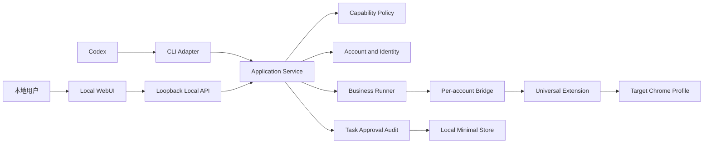

# 自动多账号小红书运营系统 V1 优化与开发执行总计划

版本：v1.0
状态：已授权的工作区开发计划
制定日期：2026-08-13
适用工作区：`C:\Users\EDY\Documents\Codex\2026-07-31\readme-md\xiaohongshu-skills`

关联文档：

- [产品需求文档](PRD.md)
- [第一版需求追踪矩阵](PRD-TRACEABILITY.md)
- [多账号改造报告](XIAOHONGSHU-MULTI-ACCOUNT-REFACTOR-REPORT-2026-08-03.md)

---

## 1. 这份文档的用途

本文件不是建议清单，而是交给 Codex 直接执行的 V1 开发总计划。

Codex 应当按照本文件的阶段顺序，在当前工作区内持续完成设计、编码、测试、修复、文档更新和
阶段验收。一个阶段内部不需要为普通代码修改反复询问用户；只有遇到本文件明确禁止的操作、
需要真实账号参与的验收、需要另一台电脑配合，或者必须改变已冻结的产品边界时，才停止并向用户
申请新的授权。

本计划解决的核心问题是：当前项目已经具备较强的多账号工程底座，但普通用户还不能从“一键进入”
开始，独立完成账号配置、运营任务、外发确认和结果回看。V1 的目标是把这些能力连接成一个完整、
可验收的产品闭环。

---

## 2. Codex 的执行授权与边界

### 2.1 已授权的操作

Codex 可以自主完成：

- 修改当前工作区中的 Python、JavaScript、HTML、CSS、PowerShell、测试和 Markdown；
- 新增本计划需要的工作区文件和测试夹具；
- 重构应用服务层、Web API、WebUI 和本地持久化代码；
- 运行自动化测试、静态检查、编译检查和本地只读 WebUI 验证；
- 使用测试目录、临时配置和模拟 Bridge 完成故障场景测试；
- 在每个阶段结束时更新 PRD、追踪矩阵、README 和本计划的进度表；
- 在发现阶段内缺陷时直接修复并重新测试，直到阶段验收通过。

### 2.2 未授权的操作

除非用户另行明确确认，Codex 不得：

- 把工作区同步到 `C:\Users\EDY\.codex\skills\xiaohongshu-skills`；
- 修改 `C:\Users\EDY\.xhs\accounts` 中的真实账号配置；
- 执行 `account-sync`、`account-identity --record`、登录、退出、换号或重新配对真实 Profile；
- 对真实小红书账号搜索、点赞、收藏、评论、回复或发布内容；
- 自动启动、重启或关闭用户的 Chrome；
- 安装软件、创建 Windows 自启动项、创建桌面快捷方式或修改系统设置；
- 推送 GitHub、发布版本、覆盖远程仓库或操作另一台电脑；
- 把自动化测试通过描述成真实 Chrome、真实账号或跨电脑验收通过。

### 2.3 开发中的数据隔离

所有自动化测试必须使用临时目录或明确的测试配置根目录，不读取或写入真实账号目录。需要账号、
Profile、UID、扩展连接或任务数据时，使用虚构数据和可控测试替身。测试结束后不得留下会影响正常
使用的后台进程。

---

## 3. V1 产品边界冻结

### 3.1 一句话定位

为同时经营多个小红书账号的个人运营者提供一套本地运营工作台：安全管理 6 个账号槽位，自动完成
允许自动化的重复任务，让所有对外文字在发送前可确认、执行后可追溯。

### 3.2 核心用户

- 同时管理至少 5 个小红书账号的个人运营者；
- 了解小红书运营，但不要求懂 Python、PowerShell、端口、Bridge 或扩展开发；
- 接受本地运行和手动维护 Chrome 登录状态，不要求云端远程控制。

### 3.3 V1 必须完成的能力

1. 双击一个入口即可检查环境、启动本地服务并打开 WebUI；
2. 用户不使用命令行即可新建槽位或绑定已有 Chrome Profile；
3. WebUI 引导用户完成扩展加载、配对、登录状态检查和 UID 确认；
4. 首页明确区分“配置健康”和“当前 READY”，并给出唯一推荐动作；
5. L0 支持浏览、搜索、详情和用户主页等只读任务；
6. L1 支持点赞和收藏，并具备配额、去重、熔断和结果回读；
7. 评论和回复必须先生成本地草稿，再由用户确认最终版本后执行；
8. 所有执行返回明确终态，并能在 WebUI 查看最小结果记录；
9. 提供全局暂停，阻止新的自动化业务任务开始执行；
10. WebUI、CLI 和 Codex 使用同一应用服务、能力元数据和状态语义。

### 3.4 V1 明确不做

- 图文、视频、长文发布以及定时发布；
- 私信发送；
- 自动修改公开资料；
- WebUI 自建定时调度中心；
- 云端 SaaS、团队协作、远程控制和组织权限；
- 完整数据采集产品、日报、周报和经营分析；
- 自动启动、重启或关闭 Chrome；
- 冷登录、复制 Profile、复制 Cookie 或迁移登录状态；
- 通用浏览器 Agent 临时探索未知页面后直接执行写操作。

### 3.5 V1 账号运行模型

- 标准支持 6 个账号槽位；
- 6 个槽位均采用用户维护的热登录模式；
- 用户手动打开需要在线的 Chrome Profile；
- 系统不保证 6 个 Profile 始终在线，只展示实时可用数量；
- 同一账号任务严格串行；
- 不同账号最多 3 个业务任务并行；
- 浏览器离线时任务进入 `BLOCKED`，不自动打开 Chrome；
- “3 个常在线、3 个按需启动”的冷启动自动化不属于 V1。

### 3.6 V1 能力等级

| 等级 | V1 能力 | 执行规则 |
|---|---|---|
| L0 | 状态检查、首页 Feed、搜索、详情、用户主页、风险报告 | 明确账号后可自动执行，允许有限安全重试 |
| L1 | 点赞、取消点赞、收藏、取消收藏 | 必须检查 UID、配额、去重、熔断并回读结果 |
| L2 | 评论、回复 | 仅允许“草稿—最终确认—发送”，不允许定时发送 |
| L3 | 添加/导入槽位、配对、登录、记录 UID、换号、自启动设置 | 必须展示影响并取得显式确认 |

发布相关命令可以保留兼容代码，但必须在 V1 的服务层、API 和产品入口统一拒绝执行。私信不进入
V1 能力注册，不在界面中显示为即将可发送的能力。

---

## 4. V1 唯一主流程

```text
双击启动系统
→ WebUI 检查环境
→ 添加或导入账号槽位
→ 用户手动打开正确 Chrome Profile
→ 加载通用扩展并在目标 Profile 内确认配对
→ 检查登录并确认 UID
→ 账号进入 READY
→ 创建搜索/点赞/收藏任务
→ 执行并记录结果
→ 生成评论或回复草稿
→ 用户核对账号、UID、目标和最终文本
→ 确认后发送
→ 在执行记录中查看最终状态与下一步建议
```

任何新增功能如果不能直接提高这条主流程的成功率、可理解性或可恢复性，默认移出 V1。

---

## 5. 目标信息架构

V1 一级导航只保留五个入口：

1. **首页**：账号可用性、今日任务、待确认事项、最近失败和全局暂停；
2. **账号**：账号列表、添加账号向导、账号详情、连接与身份状态；
3. **任务与确认**：即时任务、等待确认的草稿和执行进度；
4. **执行记录**：按账号、能力、状态和时间查看最小结果；
5. **设置**：并发、L1 配额、Bridge 自启动、诊断、版本和高级信息。

Bridge、端口、Python 路径和内部命令默认只出现在“高级信息”中。首页和账号页使用用户语言：
“浏览器未打开”“扩展未连接”“需要确认当前账号”，而不是只显示内部状态枚举。

### 5.1 首页必须回答的五个问题

- 现在有多少账号可以执行？
- 哪些账号需要我处理？
- 今天有哪些任务已经完成或失败？
- 有哪些内容等待我确认？
- 我能否一键暂停所有新任务？

### 5.2 账号卡片的最小信息

- 槽位别名；
- 已确认昵称和 UID 的脱敏展示；
- 当前综合状态；
- 最近活动时间；
- 唯一推荐动作；
- 可展开的 Chrome、扩展、Bridge、Profile 和身份详细状态。

---

## 6. 目标技术结构



### 6.1 架构规则

- WebUI 不拼接或执行任意 Shell 字符串；
- WebUI、CLI 和 Codex 都调用应用服务层；
- 能力等级、V1 是否开放、确认要求和重试策略只在能力注册表定义一次；
- 业务 Runner 只能执行注册能力；
- API 只做参数解析、会话校验和错误映射，不复制业务规则；
- 浏览器页面适配继续通过现有 `scripts/xhs/` 和 Bridge 执行；
- V1 不引入完整任务调度平台；Codex 定时任务只负责触发已注册的 L0/L1 能力；
- 最小任务、确认和执行记录使用本地轻量存储，暂不建设复杂数据分析数据库。

---

## 7. 核心对象与统一状态

### 7.1 Task 最小字段

```text
task_id
source                 # webui / codex / cli
account_slot
capability
risk_level
request_summary
state
created_at
started_at
finished_at
result_summary
error_code
recommended_action
```

任务状态统一为：

```text
QUEUED
RUNNING
WAITING_APPROVAL
SUCCESS
FAILED
BLOCKED
CANCELLED
RESULT_UNKNOWN
```

规则：

- `BLOCKED` 表示前置条件不满足，解决后可以由用户或调度器重新发起；
- `FAILED` 表示已确定没有完成；
- `RESULT_UNKNOWN` 表示写状态操作已发出但无法确认结果，禁止直接重复执行，必须先回读；
- 每个任务必须进入一个可解释的最终状态，不能长期停留在 `RUNNING`。

### 7.2 Draft 与 Approval 最小字段

```text
draft_id
draft_revision_id
account_slot
verified_uid
action_type           # post-comment / reply-comment
target_id
target_summary
content
status
updated_at

approval_id
draft_revision_id
confirmed_at
expires_at
consumed_at
```

草稿每次修改都生成新的 `draft_revision_id`，并立即使旧确认失效。执行时必须同时匹配账号槽位、
当前 UID、动作类型、目标和草稿版本。确认只能使用一次，并在短时间内有效。

### 7.3 最小事件记录

```text
event_id
task_id
account_slot
capability
state
verified_uid
started_at
finished_at
result_summary
error_code
evidence_reference
```

不得记录 Cookie、验证码、连接令牌、配对包、未脱敏手机号或浏览器加密凭据。

---

## 8. API 目标范围

具体 URL 可以在实现时小幅调整，但能力边界不得变化。

### 8.1 只读接口

- `GET /api/v1/health`
- `GET /api/v1/capabilities`
- `GET /api/v1/accounts`
- `GET /api/v1/accounts/{account}/status`
- `GET /api/v1/accounts/{account}/doctor`
- `GET /api/v1/tasks`
- `GET /api/v1/tasks/{task_id}`
- `GET /api/v1/drafts`
- `GET /api/v1/records`
- `GET /api/v1/system/status`

### 8.2 状态修改接口

- `POST /api/v1/accounts/discover`
- `POST /api/v1/accounts`
- `POST /api/v1/accounts/import`
- `POST /api/v1/accounts/{account}/pairing/begin`
- `POST /api/v1/accounts/{account}/identity/check`
- `POST /api/v1/accounts/{account}/identity/record`
- `POST /api/v1/tasks`
- `POST /api/v1/tasks/{task_id}/cancel`
- `POST /api/v1/drafts`
- `PATCH /api/v1/drafts/{draft_id}`
- `POST /api/v1/drafts/{draft_id}/confirm`
- `POST /api/v1/drafts/{draft_id}/execute`
- `POST /api/v1/system/pause`
- `POST /api/v1/system/resume`

所有状态修改接口必须返回稳定 JSON 错误码。至少统一：

```text
INVALID_REQUEST
CAPABILITY_DISABLED
CONFIRMATION_REQUIRED
CONFIRMATION_EXPIRED
DRAFT_CHANGED
ACCOUNT_NOT_READY
IDENTITY_MISMATCH
RATE_LIMITED
DUPLICATE_ACTION
RISK_BLOCKED
RESULT_UNKNOWN
GLOBAL_PAUSED
NOT_FOUND
INTERNAL_ERROR
```

本地 WebUI 与 API 继续只监听 `127.0.0.1`。状态修改接口采用一个简单、同源的本地会话令牌保护，
不建设账号密码系统或复杂权限框架。

---

## 9. 分阶段开发计划

## 阶段 0：统一产品合同和工程基线

### 目标

消除 PRD、追踪矩阵、Skill 说明、能力注册和现有 CLI 之间的 V1 冲突，让后续开发只有一个产品
答案。

### 主要工作

1. 更新 `docs/PRD.md`：
   - 私信移出 V1；
   - 评论和回复保留确认后执行；
   - 所有 6 个槽位采用热登录；
   - WebUI 不自建调度中心；
   - 发布在 V1 统一禁用；
   - 增加本计划中的产品成功指标。
2. 更新 `docs/PRD-TRACEABILITY.md`，拆分并补齐任务、草稿、确认、全局暂停和最小记录需求 ID；
3. 更新 `scripts/capability_registry.py`，确保每个公开 CLI 命令都有唯一策略；
4. 明确 `account-identity` 的只读检查和记录动作在服务层是两个不同能力；
5. 增加自动化测试，保证 V1 禁用能力无法从服务层绕过；
6. 在 README 中清楚区分“工程 CLI 已存在”和“V1 产品开放”。

### 建议修改文件

- `docs/PRD.md`
- `docs/PRD-TRACEABILITY.md`
- `README.md`
- `SKILL.md`
- `scripts/capability_registry.py`
- `tests/test_capability_registry.py`

### 阶段验收

- PRD、追踪矩阵、能力注册和 README 对 V1 能力范围表述一致；
- 发布和私信不被标记为 V1 可执行能力；
- 评论、回复要求最终草稿即时确认；
- 所有公开 CLI 命令具有权限元数据；
- 完整自动化测试 0 failed、0 errors。

---

## 阶段 1：应用服务与本地最小存储

### 目标

把当前只读应用服务扩展为统一产品服务，为 WebUI、CLI 和 Codex 提供相同的执行、状态和错误语义。

### 主要工作

1. 将 `ApplicationService` 按职责拆分，但保持一个稳定入口；
2. 新增轻量本地存储，保存系统设置、全局暂停、任务、草稿、确认和最小执行结果；
3. 存储使用原子替换和进程内/文件锁，支持测试中并发写入；
4. 新增统一服务错误码和 API 映射；
5. 新增能力执行入口，只允许执行能力注册表中的命令；
6. 在服务层强制执行 V1 开关、目标账号、UID 检查和确认要求；
7. 保留现有 CLI 输出兼容，逐步让 CLI 调用应用服务，而不是复制规则；
8. 为任务超时和进程中断提供启动时状态修复：遗留 `RUNNING` 根据操作类型转为 `FAILED` 或
   `RESULT_UNKNOWN`，不自动重复写状态操作。

### 建议新增或修改文件

- `scripts/application_service.py`
- `scripts/product_store.py`
- `scripts/task_service.py`
- `scripts/approval_service.py`
- `scripts/service_errors.py`
- `scripts/capability_registry.py`
- `scripts/cli.py`
- `tests/test_application_service.py`
- `tests/test_product_store.py`
- `tests/test_task_service.py`
- `tests/test_approval_service.py`

### 阶段验收

- WebUI、CLI 适配器调用同一服务方法；
- 禁用能力、缺少确认、账号不 READY、身份不一致均在服务层被阻止；
- 编辑草稿后旧确认失效；
- 确认过期或重复消费被拒绝；
- 测试数据不写入真实账号目录；
- 完整自动化测试 0 failed、0 errors。

---

## 阶段 2：本地 API 写能力与一键启动

### 目标

让普通用户双击进入产品，并为 WebUI 配置流程提供受控的状态修改 API。

### 主要工作

1. 为 `scripts/web_server.py` 增加 JSON 请求体解析、大小限制、稳定错误响应和状态修改路由；
2. 增加简单同源本地会话令牌，防止其他页面随意调用本机状态修改接口；
3. 保持所有服务只监听 `127.0.0.1`；
4. 增加 Windows 双击启动入口：
   - 优先复用项目 `.venv` 或本机兼容 Python；
   - 检查依赖；
   - 避免重复启动 Web 服务；
   - 启动成功后打开默认浏览器；
   - 缺少 Python 时只展示说明，不未经确认下载或安装；
5. 增加 Web 服务 PID 和健康状态，但不在此阶段启动 Chrome；
6. 启动失败时给出普通用户可理解的原因和修复建议。

### 建议新增或修改文件

- `scripts/web_server.py`
- `scripts/web_session.py`
- `scripts/web_lifecycle.py`
- `scripts/bootstrap.ps1`
- `scripts/start-webui.ps1`
- `start-auto-xhs.cmd`
- `tests/test_web_server.py`
- `tests/test_web_lifecycle.py`
- `tests/test_bootstrap.py`

### 阶段验收

- 双击入口能够启动服务并打开 WebUI；
- 已运行时再次启动不会产生第二个控制台实例；
- 非回环地址监听被拒绝；
- 没有本地会话令牌的状态修改请求被拒绝；
- 只读接口保持兼容；
- 测试结束没有遗留服务进程；
- 完整自动化测试 0 failed、0 errors。

说明：真正的“另一台 Windows 电脑双击验收”只能标为待实机验收，不能由单机自动化测试代替。

---

## 阶段 3：WebUI 添加账号与 READY 闭环

### 目标

用户不使用 PowerShell 即可完成第一个账号槽位配置，并准确知道下一步该做什么。

### 主要工作

1. 将 WebUI 导航重构为首页、账号、任务与确认、执行记录、设置；
2. 新增首次设置向导和可恢复步骤状态；
3. 支持两种添加方式：
   - 新建独立槽位；
   - 绑定已有 Chrome Profile；
4. 在 WebUI 中接入 Profile 发现与选择；
5. 接入槽位创建、端口分配、通用扩展路径提示和配对请求；
6. 明确要求用户手动打开目标 Profile，并在该 Profile 的扩展中确认配对；
7. 配对成功后接入登录检查、UID 读取和用户确认记录流程；
8. 账号状态统一计算为一个综合状态，并给出唯一推荐动作；
9. 添加账号失败时回滚不完整槽位资源，不影响既有账号；
10. 高级区域才展示路径、Bridge、端口和内部状态。

### 建议新增或修改文件

- `scripts/application_service.py`
- `scripts/account_manager.py`
- `scripts/account_pairing.py`
- `scripts/account_runtime.py`
- `scripts/web_server.py`
- `webui/index.html`
- `webui/app.js`
- `webui/styles.css`
- 可按页面拆分 `webui/js/` 和 `webui/css/`
- `tests/test_application_service.py`
- `tests/test_accounts.py`
- `tests/test_account_pairing.py`
- `tests/test_web_server.py`

### 阶段验收

- 无需命令行即可走完模拟的新建槽位流程；
- 无需命令行即可走完模拟的绑定已有 Profile 流程；
- 重名、重复 Profile、端口冲突和中途失败有清晰错误并保持已有数据完整；
- 配对、扩展连接和 UID 未完成前不得显示 READY；
- 离线账号只显示一个明确推荐动作；
- 页面在 1366×768 下可以完成核心流程；
- 完整自动化测试 0 failed、0 errors。

真实 Profile、扩展实例和真实 UID 只能保留为待用户授权的实机验收。

---

## 阶段 4：L0/L1 任务、配额和执行记录

### 目标

完成第一个真正可用的运营闭环：从 WebUI 或 Codex 发起只读/点赞收藏任务，执行后得到可追溯结果。

### 主要工作

1. 实现统一任务创建和执行入口；
2. L0 接入首页 Feed、搜索、详情和用户主页；
3. L1 接入点赞、取消点赞、收藏和取消收藏；
4. 执行前检查账号 READY、UID、全局暂停和能力策略；
5. 实现同账号串行、不同账号最多 3 个任务并行；
6. 实现 L1 配额：默认单任务、每小时和每日上限，可在设置中调整合理范围；
7. 以账号、能力和目标对象组成去重键，防止短时间重复操作；
8. 连续明确失败、验证码、异常登录或风险信号触发账号级熔断；
9. L1 执行后回读状态；无法确定结果时进入 `RESULT_UNKNOWN`；
10. 新增任务列表、任务详情时间线、筛选和推荐动作；
11. 实现全局暂停和恢复；暂停后不启动新任务，当前原子步骤结束后停止后续步骤；
12. 为 Codex 定时触发提供稳定 CLI/服务入口，但不在 WebUI 建调度页面。

### 建议新增或修改文件

- `scripts/task_service.py`
- `scripts/business_runner.py`
- `scripts/quota_service.py`
- `scripts/application_service.py`
- `scripts/cli.py`
- `scripts/xhs/like_favorite.py`
- `scripts/web_server.py`
- `webui/` 任务与记录页面
- `tests/test_task_service.py`
- `tests/test_quota_service.py`
- `tests/test_application_service.py`
- `tests/test_web_server.py`
- 现有 XHS 业务测试

### 阶段验收

- L0 正常、失败、离线和超时场景都有明确终态；
- L1 在缺少 UID、超过配额、重复目标、熔断和全局暂停时被正确阻止；
- 同账号不会并发执行页面任务；
- 不同账号不会超过全局并发上限；
- L1 回读不确定时不会自动重复操作；
- 任务和最小执行记录能够在服务重启后读取；
- Codex 调度入口只能触发 V1 允许定时的能力；
- 完整自动化测试 0 failed、0 errors。

此阶段自动化测试不得对真实账号执行点赞或收藏。

---

## 阶段 5：评论与回复的草稿确认闭环

### 目标

让外发文字只有在用户看见最终账号、身份、目标和文本并确认后，才允许执行。

### 主要工作

1. 新增评论和回复草稿创建、编辑、保存和删除；
2. 草稿页面展示目标账号、当前昵称/UID、目标笔记或评论、最终文本和字数；
3. 用户点击确认时创建短时、单次确认；
4. 草稿任何字段改变后旧确认立即失效；
5. 执行前再次核验账号 READY、当前 UID、目标和草稿版本；
6. 评论和回复不支持定时执行、不支持批量静默确认；
7. 发送后回读结果；不确定时进入 `RESULT_UNKNOWN` 并提示人工检查；
8. V1 对发布、私信和公开资料修改返回 `CAPABILITY_DISABLED`；
9. 记录确认来源、确认时间、执行结果和最小证据引用，但不保存秘密。

### 建议新增或修改文件

- `scripts/approval_service.py`
- `scripts/task_service.py`
- `scripts/business_runner.py`
- `scripts/application_service.py`
- `scripts/xhs/comment.py`
- `scripts/web_server.py`
- `webui/` 草稿与确认页面
- `tests/test_approval_service.py`
- `tests/test_application_service.py`
- `tests/test_web_server.py`
- 评论适配器测试

### 阶段验收

- 未确认、确认过期、草稿修改、账号变化、UID 变化和目标变化均拒绝发送；
- 同一个确认不能消费两次；
- 评论和回复的模拟成功、失败、阻塞和结果未知均有记录；
- 发布和私信不能通过 API、服务层或 CLI 产品入口绕过 V1 禁用；
- 完整自动化测试 0 failed、0 errors。

此阶段自动化测试不得向真实小红书发送评论或回复。

---

## 阶段 6：生命周期、诊断和产品化收尾

### 目标

让系统遇到普通故障时可理解、可恢复，并具备交给普通用户试用的基本完整度。

### 主要工作

1. 完成 Bridge PID、启动、停止、重启和健康检查；
2. 确保进程操作只针对本项目已登记进程；
3. 完成账号注册全局锁、配置原子写入和失败回滚；
4. 增加脱敏诊断导出；
5. 设置页完成并发、L1 配额、熔断、Bridge 自启动状态、版本和诊断；
6. 首页补齐最近失败、待确认数量、今日任务和全局暂停；
7. 所有常见错误提供一个首选恢复动作；
8. 完成空状态、加载状态、错误状态和键盘可用性；
9. 检查 1366×768 布局，不让核心按钮落在不可见区域；
10. 更新 README、安装说明、普通用户操作手册、故障恢复和卸载保留数据说明。

### 建议新增或修改文件

- `scripts/account_runtime.py`
- `scripts/account_manager.py`
- `scripts/account_doctor.py`
- `scripts/web_lifecycle.py`
- `scripts/application_service.py`
- `webui/` 全部产品页面
- `tests/test_bridge_lifecycle.py`
- `tests/test_accounts.py`
- `tests/test_account_doctor.py`
- `tests/test_web_lifecycle.py`
- `README.md`
- `docs/USER-GUIDE.md`
- `docs/TROUBLESHOOTING.md`

### 阶段验收

- Bridge 生命周期测试覆盖正常启动、重复启动、异常退出和错误 PID；
- 账号并发创建不会产生重复 Profile 绑定或端口；
- 诊断导出不包含禁止记录字段；
- WebUI 核心页面完成桌面视觉检查；
- 用户文档能够从零带领用户完成主流程；
- 完整自动化测试 0 failed、0 errors。

---

## 阶段 7：真实设备与跨电脑验收

### 目标

验证自动化测试无法证明的 Chrome、扩展、真实登录、Windows 启动和跨电脑体验。

### 执行前置

这个阶段必须由用户另行授权，并提供真实测试账号、目标 Profile 和另一台 Windows 电脑配合。
Codex 在没有授权时只能生成验收手册和记录模板，不能自行执行真实账号操作。

### 验收顺序

1. 当前电脑双 Profile 防串号验收；
2. 当前电脑关闭 Profile 后进入 BLOCKED、重新手动打开后恢复；
3. 当前电脑只读 L0 实机任务；
4. 经用户逐项确认后进行一个测试账号的 L1 点赞/取消点赞闭环；
5. 经用户逐项确认后进行一条测试评论的草稿—确认—发送—回读闭环；
6. 另一台 Windows 电脑全新安装和首次配置；
7. 另一台电脑由 Codex 定时任务触发一次已授权的 L0/L1 测试；
8. 形成验收报告，未通过项回到对应开发阶段修复。

### 发布前必须取得的证据

- 两台 Windows 电脑完成双击启动；
- 至少两个真实 Chrome Profile 不串号；
- 关闭浏览器时任务明确 BLOCKED，系统不自动启动 Chrome；
- 用户不使用 PowerShell即可完成首个账号配置；
- L1 配额、去重和回读在真实页面有效；
- 评论/回复未经最终确认无法执行；
- 所有真实操作有用户可查看的结果记录。

---

## 10. 自动化测试总矩阵

| 测试层 | 必须覆盖 |
|---|---|
| 单元测试 | 能力策略、状态转换、配额、去重、草稿版本、确认消费、错误映射 |
| 服务测试 | V1 禁用、身份校验、全局暂停、任务终态、存储恢复 |
| API 测试 | 参数、会话、成功响应、稳定错误码、只监听回环地址 |
| 并发测试 | 同账号串行、跨账号上限、账号创建锁、重复执行 |
| Bridge 测试 | 槽位身份、Profile 声明、扩展实例、PID 生命周期 |
| WebUI 测试 | 首次设置、账号状态、任务、确认、记录和错误恢复 |
| 回归测试 | 现有 63 项测试持续通过，新增测试 0 failed、0 errors |
| 实机测试 | Chrome、扩展、真实 UID、Windows 双击启动和跨电脑，仅经用户授权执行 |

标准测试命令：

```powershell
$env:PYTHONPATH = 'scripts'
$env:PYTHONUTF8 = '1'
.\.venv\Scripts\python.exe -m pytest -q
```

如果增加前端测试工具，必须优先使用项目已有环境；需要安装新依赖时先向用户说明用途并取得确认。

---

## 11. 产品成功指标

以下指标分为自动化门槛和实机目标，不能混为一谈。

### 11.1 自动化发布门槛

- 完整测试 0 failed、0 errors；
- 所有公开能力有唯一权限元数据；
- V1 禁用能力无法从服务、API 和产品 CLI 绕过；
- 所有测试数据与真实账号目录隔离；
- 每种任务路径都有明确终态；
- 账号、UID、草稿和确认不一致时外发操作被阻止。

### 11.2 实机产品目标

- 新用户在 15 分钟内让第一个账号进入 READY；
- 普通流程不需要输入 PowerShell 命令；
- 多账号串号事故为 0；
- 正常环境下 L0/L1 任务明确完成率达到 95%；
- 100% 的任务得到成功、失败、阻塞、取消或结果未知反馈；
- 常见离线、未配对和身份异常能够通过一个推荐动作进入恢复流程；
- 草稿修改后旧确认失效率为 100%。

---

## 12. Codex 阶段执行规则

Codex 接手本文档后按以下方式工作：

1. 首先读取 `HANDOFF.md`、本计划、PRD、追踪矩阵和当前代码；
2. 只读运行当前基线测试和 `account-doctor`，记录实际结果，不操作真实账号；
3. 从阶段 0 开始，一次只把一个阶段标记为 `IN_PROGRESS`；
4. 阶段内自主完成代码、测试、修复和文档，不为普通实现细节反复询问；
5. 不覆盖用户已有的无关改动，不使用破坏性 Git 操作；
6. 每完成一个小切片先运行相关测试，阶段结束运行完整测试；
7. 只有满足阶段验收后，才把需求状态更新为 `AUTOMATED_TESTED`；
8. 需要真实 Chrome 的项目只能标为 `IMPLEMENTED` 或 `AUTOMATED_TESTED`，等待阶段 7；
9. 每阶段输出一份简短阶段报告：完成内容、测试结果、未验证事项、下一阶段；
10. 如果发现本计划与现实代码冲突，优先保持产品边界，选择最小可维护改动，并把差异记录到本文件；
11. 如果阻塞只影响某个非关键项，记录后继续其他可独立工作；如果会改变产品范围或需要新权限，停止并请求用户决定；
12. 阶段 0—6 完成后停止，不自动同步 Skill、不操作真实账号，向用户申请阶段 7 验收授权。

### 12.1 每阶段报告模板

```text
阶段：
状态：完成 / 部分完成 / 阻塞

完成：
-

验证：
- 相关测试：
- 完整测试：
- 视觉检查：

尚未验证：
-

追踪矩阵更新：
-

下一步：
-
```

---

## 13. 总进度表

| 阶段 | 内容 | 初始状态 | 完成门槛 |
|---|---|---|---|
| 0 | 产品合同与工程基线 | COMPLETED | 文档、能力注册和测试一致；68 passed |
| 1 | 应用服务与最小存储 | COMPLETED | 任务、草稿、确认、暂停和恢复通过；83 passed |
| 2 | API 写能力与一键启动 | COMPLETED | 会话保护、写 API 和一实例启动通过；87 passed |
| 3 | WebUI 添加账号与 READY | COMPLETED | 模拟添加、配对、UID 和 READY 通过；94 passed |
| 4 | L0/L1 任务与执行记录 | COMPLETED | Runner、配额、去重、熔断和记录通过；102 passed |
| 5 | 评论/回复草稿确认 | COMPLETED | 版本、UID、目标和一次性确认通过；106 passed |
| 6 | 生命周期与产品化收尾 | COMPLETED | PID、事务、诊断、设置、文档、1366×768 Chrome 视觉检查及 115 项完整回归通过 |
| 7 | 真实设备和跨电脑验收 | WAITING_USER_AUTHORIZATION | 取得真实设备验收证据 |

---

## 14. 最终完成定义

只有同时满足以下条件，才可以把 V1 描述为“开发完成”：

1. 阶段 0—6 的所有自动化验收通过；
2. 追踪矩阵中的 P0 项至少达到 `AUTOMATED_TESTED`；
3. V1 主流程从双击启动到执行记录在测试环境完整连通；
4. 发布、私信和其他禁用能力不能从产品入口绕过；
5. 工作区没有被错误同步到已安装 Skill；
6. 未经授权没有修改任何真实账号状态；
7. 用户另行授权后完成阶段 7，相关需求才可以标记为 `REAL_DEVICE_VERIFIED`；
8. 最终向用户清楚区分：已经自动化验证、已经真实设备验证、仍待验证的内容。

本计划对阶段 0—6 构成工作区开发授权，但不构成 Skill 部署、真实账号操作、GitHub 发布或跨电脑
执行授权。
