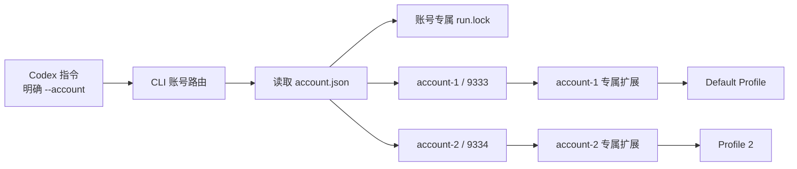
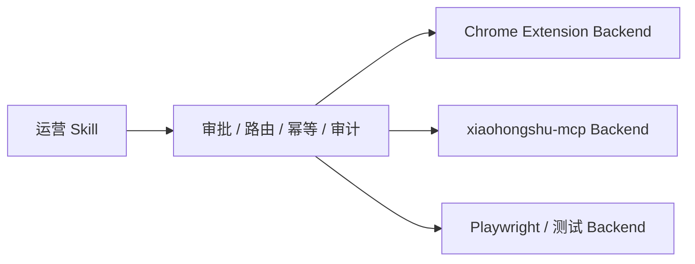

# 小红书自动化项目改造对比报告

日期：2026-08-03  
当前工作区：`C:\Users\EDY\Documents\Codex\2026-07-31\readme-md\xiaohongshu-skills`  
Codex Skill 副本：`C:\Users\EDY\.codex\skills\xiaohongshu-skills`

## 1. 报告结论

本次工作的本质不是重新实现一个小红书自动化项目，而是在原版
`autoclaw-cc/xiaohongshu-skills` 的“单浏览器、单扩展、单 Bridge、单账号”模型之上，
增加一层本地多账号治理能力。

改造后的核心模型是：

> 一个账号别名 = 一个 Chrome Profile + 一个扩展副本 + 一个 Bridge 端口 + 一个任务锁。

当前已经实现并实际使用的能力包括：

- 创建全新的独立 Chrome 账号环境；
- 发现并绑定已有 Chrome Profile，不复制 Cookie 或 Profile；
- 将已存在的账号别名安全改绑到另一个 Profile；
- 为每个账号自动分配不同的 Bridge 端口；
- 在扩展、Bridge server 和 CLI 三端校验账号路由；
- 不同账号可以并发，同一账号强制串行；
- Windows 下安全判断锁持有进程是否存活；
- 显示扩展当前账号和 Bridge 地址；
- 保持旧单账号配置兼容；
- 增加自动化测试和 Skill 运行约束。

当前本机配置为：

| Codex 账号别名 | Chrome Profile | Bridge | 状态 |
|---|---|---:|---|
| `account-1` | `Default`（您的 Chrome 数据） | `ws://localhost:9333` | 用户已确认连接正常 |
| `account-2` | `Profile 2`（test） | `ws://localhost:9334` | 用户已确认连接正常 |

当前版本的多账号主链路已经可用，但还不是完整的生产级调度系统。它仍缺少进程生命周期管理、
全局配置事务锁、可靠审计、写操作幂等、完整回读验证和真实双浏览器端到端自动化测试。

## 2. 对比对象和边界

### 2.1 真正被改造的项目

原始代码基线是：

- 项目：`autoclaw-cc/xiaohongshu-skills`
- 基线发布版：`v0.1.0-b043748`
- 原始本地说明：`C:\Users\EDY\Downloads\README.md`
- 上游地址：<https://github.com/autoclaw-cc/xiaohongshu-skills>

本报告使用该发布版源码与当前工作区逐文件比较。以下统计不计本报告文件自身：

| 指标 | 数量 |
|---|---:|
| 新增文件 | 6 |
| 修改文件 | 18 |
| 删除文件 | 0 |
| 文本新增行 | 1,627 |
| 文本删除行 | 84 |

行数是文本差异统计，包含代码、测试和文档，不等同于纯业务代码行数。

### 2.2 交接文档中的另一个项目

`C:\Users\EDY\Downloads\HANDOFF-XIAOHONGSHU-MCP-OTHER-PC-2026-07-31.md`
描述的是另一个项目：`xpzouying/xiaohongshu-mcp v2.2.6`。

它是早期准备在另一台电脑验证的 MCP 执行器，不是本次直接修改的代码库。交接文档提出的
`account_id` 路由、单账号锁、审批、幂等和审计等治理方向，成为本次改造的重要参考。

## 3. 原版架构

原版使用用户自己的 Chrome，通过 Manifest V3 扩展和本地 WebSocket Bridge 控制页面。


原版的几个关键假设是：

- Bridge 地址固定为 `ws://localhost:9333`；
- 扩展代码中写死 9333；
- CLI 没有账号参数；
- Chrome 启动时不指定账号专属 `user-data-dir`；
- 所有命令共用一个全局锁；
- 系统默认只有一个活动扩展和一个小红书账号。

这套设计对单账号简单直接，但账号一多就会出现以下问题：

1. 两个扩展同时连接 9333，不知道该把命令发给哪个浏览器；
2. 不同 Chrome Profile 可能误加载同一个扩展目录；
3. Cookie、登录状态和页面上下文可能混用；
4. 全局锁会让本来互不相关的账号也不能并发；
5. Codex 无法仅凭自然语言稳定判断操作目标账号。

## 4. 当前架构



每个账号的运行配置保存在：

```text
C:\Users\EDY\.xhs\accounts\<账号别名>\
├── account.json
├── account.previous.json      # 发生改绑时保存上一份配置
├── extension\                 # 账号专属扩展副本
├── chrome-profile\            # 仅 managed 模式使用
└── run.lock                   # 账号专属任务锁
```

账号配置模型包含：

```json
{
  "name": "account-1",
  "bridge_port": 9333,
  "chrome_user_data_dir": "C:/.../Chrome/User Data",
  "extension_dir": "C:/Users/EDY/.xhs/accounts/account-1/extension",
  "chrome_profile_directory": "Default",
  "profile_mode": "existing"
}
```

`profile_mode` 有三种实际语义：

| 模式 | 含义 |
|---|---|
| `managed` | 工具新建独立 `chrome-profile`，账号间完全隔离 |
| `existing` | 绑定已有 Chrome Profile，保留原登录状态 |
| `legacy` | 兼容原版没有账号配置文件的默认单账号模式 |

## 5. 具体改造内容

### 5.1 新增账号配置和 Profile 管理层

新增文件：`scripts/account_manager.py`。

它负责：

- 校验账号别名，避免路径穿越和非法目录名；
- 保存和读取 `account.json`；
- 创建账号专属 Chrome 数据目录和扩展副本；
- 自动寻找空闲 Bridge 端口；
- 同时检查“已被其他账号登记”和“已被系统其他进程占用”；
- 发现系统 Chrome 的 `Default`、`Profile N` 和显示名称；
- 检查一个 Profile 是否已经绑定其他账号；
- 绑定已有 Profile，但不读取 Cookie、不复制 Profile；
- 用 `--replace` 改绑已有账号，并备份旧配置；
- 更新账号扩展时重新写入正确的账号和端口路由。

为什么这样改：

- Chrome Profile 本身已经保存 Cookie、Local Storage 和登录状态，复制 Profile 容易损坏数据，
  也可能产生锁文件、加密密钥和同步状态问题；
- 绑定目录比导出 Cookie 更接近用户的真实日常浏览器环境；
- 每账号独立扩展副本可以让 `bridge_config.js` 固化自己的账号名和端口；
- 账号别名只作为本地槽位，不保存手机号、密码或验证码。

### 5.2 新增账号管理 CLI

CLI 新增全局参数：

```text
--account <账号别名>
--bridge-url <临时覆盖地址>
--lock-timeout <秒数>
```

新增命令：

| 命令 | 用途 |
|---|---|
| `account-add` | 创建全新的独立账号环境 |
| `account-discover` | 列出本机已有 Chrome Profile 和绑定状态 |
| `account-import` | 将已有 Profile 绑定到账号别名 |
| `account-import --replace` | 将已有账号安全改绑到另一个 Profile |
| `account-list` | 查看所有账号配置 |
| `account-start` | 启动指定账号的 Bridge 和 Chrome |
| `account-status` | 查看 Bridge server 和扩展连接状态 |
| `account-sync` | 将工作区扩展代码同步到账号专属副本 |

所有原业务命令都可以在子命令前指定账号：

```powershell
python scripts/cli.py --account account-1 search-feeds --keyword "关键词"
python scripts/cli.py --account account-2 check-login
```

为什么这样改：

- 把账号选择放在统一 CLI 入口，登录、搜索、评论和发布不需要各自重复实现多账号逻辑；
- Codex 只要明确生成 `--account`，后续连接、锁和浏览器选择就由 CLI 完成；
- 管理命令输出结构化 JSON，便于 Codex 判断下一步是加载扩展、登录还是继续操作。

### 5.3 Bridge 从“只看端口”改为“端口 + 账号握手”

修改文件：

- `extension/background.js`
- `extension/bridge_config.js`
- `scripts/bridge_server.py`
- `scripts/xhs/bridge.py`

扩展启动时读取：

```javascript
{
  account: "account-1",
  bridgeUrl: "ws://localhost:9333"
}
```

扩展和 CLI 与 Bridge server 握手时都携带 `account`。Bridge server 启动时也绑定一个账号：

```powershell
python scripts/bridge_server.py --port 9333 --account account-1
```

服务端会拒绝：

- 账号名不匹配的客户端；
- 同一账号的第二个扩展长连接。

为什么这样改：

- 端口隔离是第一层，账号握手是第二层；
- 即使配置错误地连接到其他账号端口，也不会把写操作转发到错误浏览器；
- 拒绝重复扩展能暴露“两个 Profile 加载了同一个扩展目录”的问题。

这次实际遇到的 9333 冲突，正是因为 `Profile 2` 曾误加载
`account-1\extension`。后来为 `account-2` 创建独立副本并分配 9334，冲突才解除。

### 5.4 Chrome Profile 启动方式

启动参数现在按账号配置生成：

```text
--user-data-dir=<Chrome User Data 或账号独立目录>
--profile-directory=<Default 或 Profile N>
```

对 `managed` 模式，代码仍尝试传入账号专属扩展参数；对 `existing` 模式，不传
`--disable-extensions-except` 和 `--load-extension`，避免禁用用户原有扩展或破坏日常 Profile。

Chrome 官方从 137 开始在正式品牌版 Chrome 中取消 `--load-extension` 的作用，139 又限制了
`--disable-extensions-except`。因此当前使用正式 Chrome 时，每个 Profile 首次都需要在
`chrome://extensions` 中手动“加载已解压的扩展程序”。这是浏览器安全策略限制，不是 Python
代码可以可靠绕过的问题。

为什么保留手动加载：

- 当前目标是复用用户真实 Chrome Profile 和登录环境；
- 改用 Chromium 或 Chrome for Testing 可以自动加载，但会变成另一套浏览器和 Profile，
  不再等同于用户的日常 Chrome；
- 自动修改 Chrome 的 `Secure Preferences` 不可靠，也不应作为正常安装方案。

### 5.5 扩展可观察性

修改 `popup.html` 和 `popup.js`，扩展弹窗现在显示：

- 当前账号别名；
- 当前 Bridge 地址；
- Bridge 是否连接；
- 扩展是否运行。

为什么这样改：

多账号故障最常见的原因不是代码无法执行，而是“加载了错误扩展目录”。把账号和端口显示在
扩展 UI 中，零基础用户也能直接发现两个 Profile 是否都指向 9333。

### 5.6 并发模型和 Windows 锁修复

原版所有命令共用 `~/.xhs/run.lock`。当前改为：

```text
~/.xhs/accounts/account-1/run.lock
~/.xhs/accounts/account-2/run.lock
```

效果是：

- `account-1` 与 `account-2` 可以同时执行；
- 同一账号的两个命令仍然串行，避免同时点击、导航或发布；
- 账号管理和状态查询命令不占业务操作锁。

同时修复了 Windows 锁存活检测。POSIX 系统可用 `os.kill(pid, 0)` 探测进程，但 Windows 的
语义不同，存在伤害目标进程的风险。当前通过 Windows API 的 `OpenProcess` 和
`GetExitCodeProcess` 只读判断进程是否仍然存活。

### 5.7 启动状态不再误报成功

早期实现只要 Bridge server 启动，就把 `account-start` 标记为成功。实际扩展未连接时，后续
命令仍会超时。

当前只有同时满足以下两个条件才返回 `success: true`：

```text
server_running == true
extension_connected == true
```

如果扩展未连接，输出会给出正确的账号专属扩展路径，并提醒先禁用其他 XHS Bridge 副本。

### 5.8 绑定、改绑和数据保护

`account-import` 会验证：

- `User Data` 根目录存在；
- Profile 是单个目录名，不能包含 `..`、斜杠或反斜杠；
- Profile 中存在 `Preferences`；
- 同一 Profile 没有绑定到另一个账号。

`account-import --replace` 会：

- 沿用原账号端口，避免正在运行的 Bridge 地址突然变化；
- 沿用原扩展目录；
- 把旧 `account.json` 备份为 `account.previous.json`；
- 不删除原来的独立 Chrome Profile 数据。

该能力用于把最初新建的 `account-1` 改绑到用户真正的 `Default` Profile。

### 5.9 连续浏览点赞实验模块

新增 `scripts/xhs/browse_like.py`，并调整：

- `feeds.py`：可以从当前页面提取 Feed，而不强制重新导航；
- `like_favorite.py`：可以给当前已打开的笔记点赞，而不再次打开 URL。

实验流程是：

```text
打开首页一次
→ 选择未点赞的视频卡片
→ 打开详情
→ 模拟阅读鼠标轨迹
→ 点赞当前笔记
→ 关闭详情
→ 向下滚动并随机等待
→ 处理下一条
```

这样做的原因是避免每点赞一条就刷新或重新导航，减少页面状态丢失和机械式重复行为。

但这里存在一个当前缺口：模块和测试已经存在，`CLAUDE.md` 也列出了
`browse-like-cycle`，可 `cli.py` 尚未注册该子命令。因此它目前是内部实验能力，不应当被描述为
完整的公开 CLI 功能。

### 5.10 Skill 层约束

根 `SKILL.md` 和五个子 Skill 增加了：

- 多账号操作前先列出账号；
- 多账号时必须明确目标账号；
- `--account` 必须放在子命令之前；
- 不同账号可以并发，同一账号串行；
- 评论和发布确认必须包含目标账号；
- 已有 Profile 应绑定而不是复制；
- 扩展未连接时按账号专属路径处理。

这层改造让 Codex 知道“应该怎样调用”，但它属于软策略。真正的账号路由和锁仍在 CLI 与
Bridge 中强制执行，不能只依赖提示词。

## 6. 与 xiaohongshu-mcp 方案对比

| 维度 | `xiaohongshu-mcp v2.2.6` 交接方案 | 当前定制 `xiaohongshu-skills` |
|---|---|---|
| 集成接口 | HTTP MCP，默认 `18060` | Codex Skill 调 Python CLI |
| 浏览器 | 配套独立 Chromium | 用户自己的正式 Chrome |
| 登录状态 | `COOKIES_PATH` 指向独立 Cookie 文件 | 直接使用 Chrome Profile 的真实状态 |
| 控制方式 | 独立二进制作为 MCP 服务 | 扩展通过 WebSocket Bridge 执行 DOM 操作 |
| 客户端范围 | 任何支持 HTTP MCP 的客户端 | 主要面向兼容 `SKILL.md` 的 Agent/Codex |
| 多账号思路 | 每账号独立 Cookie 文件和服务实例 | 每账号独立 Profile、扩展、端口和锁 |
| 可观察性 | 服务健康检查、MCP tools/list | CLI JSON、扩展弹窗、account-status |
| 部署成本 | 二进制、Chromium、MCP 配置 | Python、uv、正式 Chrome、手动加载扩展 |
| 真实日常 Profile | 通常不直接复用 | 可以直接绑定 |
| 当前本机实测 | 交接文档只做到未登录基础验证 | 已完成真实登录、互动和双账号 Bridge 连接 |

两者不是简单的“谁替代谁”：

- MCP 更适合作为标准化、跨客户端的执行器；
- 当前 Skill 方案更适合直接复用用户已经登录的 Chrome 和本机 Codex 工作流；
- 长期可以抽象统一执行器接口，在上层保留账号路由、审批、幂等和审计，再选择 Extension、
  MCP 或其他浏览器后端。

## 7. 测试和验证结果

原始发布版 `tests` 目录只有 `__init__.py`，没有自动化测试用例。当前增加 15 个测试用例，覆盖：

- 两账号独立端口、Profile 和扩展配置；
- 重复端口和外部进程端口冲突；
- 不同账号锁并行、同账号锁互斥；
- 扩展同步后保留账号路由；
- 已有 Profile 无复制导入；
- 一个 Profile 不能绑定两个账号；
- 已有账号安全改绑和配置备份；
- Profile 路径穿越防护；
- 旧配置兼容；
- existing 模式启动参数不会禁用原扩展；
- Profile 发现和显示名称；
- 两个 Bridge server 的并发路由和错账号拒绝；
- 连续浏览点赞只进行一次顶层导航。

2026-08-03 验证结果：

| 检查 | 结果 |
|---|---|
| `pytest` | `15 passed` |
| Skill 结构校验 | `Skill is valid!` |
| 工作区与 Codex Skill 源文件哈希 | `0` 个差异 |
| 核心改造文件 Ruff 检查 | 通过 |
| 全项目 Ruff 检查 | 未通过，仍有 17 个存量问题 |

全项目 Ruff 的 17 个问题主要是旧业务模块中的未使用导入、超长行和可简化异常处理。它们不影响
本次 15 项测试通过，但应该清理，避免未来真正的错误被静态检查噪声掩盖。

## 8. 已经解决的真实问题

### 8.1 Chrome 扩展加载目录错误

Chrome 需要选择含有 `manifest.json` 的 `extension` 子目录，不能选择整个 Skill 根目录。
当前账号命令会直接返回准确的账号专属扩展目录，减少手工选错。

### 8.2 请求超时但原因不清楚

原现象是 Bridge server 已启动，但扩展没有连接，随后业务命令等待超时。当前把
`server_running` 和 `extension_connected` 分开输出，且启动命令只有两者都为真才成功。

### 8.3 两个账号共用 9333

根因不是自动端口分配失效，而是两个 Profile 曾加载同一个 `account-1` 扩展目录。当前通过：

- `account-1 → Default → 9333`；
- `account-2 → Profile 2 → 9334`；
- 独立扩展副本；
- Bridge 账号握手；
- 重复扩展拒绝；

建立了完整隔离。

### 8.4 工作区和 Skill 目录方向混乱

中途曾直接修改安装后的 Skill 目录，流程不正确。现在已恢复为：

```text
工作区开发和测试
→ Skill 校验
→ 工作区单向同步到 C:\Users\EDY\.codex\skills\xiaohongshu-skills
→ SHA-256 一致性检查
```

当前两边源文件哈希差异为 0。

## 9. 尚未解决或仍可改造的内容

### P0：建议优先完成

#### 9.1 为账号注册表增加全局事务锁

当前业务操作有“每账号锁”，但 `account-add`、`account-import` 等管理命令没有全局锁。两个进程
同时创建账号时，可能都在端口真正绑定前判断 9335 可用，形成检查与使用之间的竞争窗口。

建议：

- 增加 `~/.xhs/accounts/registry.lock`；
- 端口分配、目录创建、配置写入在同一事务锁内完成；
- `account.json` 使用临时文件写入后原子替换；
- 失败时自动回滚未完成的扩展目录。

#### 9.2 增加 Profile/扩展实例身份

当前握手只包含账号名。若同一个账号专属扩展目录被加载到两个 Profile，服务端只能拒绝第二个
连接，却不知道第一个连接究竟来自哪个 Profile。

建议为每次绑定生成不可猜测的 `binding_id`，扩展握手携带：

```json
{
  "account": "account-1",
  "binding_id": "...",
  "extension_version": "1.1.0"
}
```

再增加 `account-doctor`，检测：

- 账号配置和扩展路由是否一致；
- 端口对应的 Bridge 是否属于该账号；
- 扩展代码版本是否落后；
- 一个扩展目录是否被多个 Profile 加载；
- 当前连接是否来自预期 binding。

#### 9.3 补齐 Bridge 进程生命周期

当前可以启动 Bridge，但没有：

- `account-stop`；
- `account-restart`；
- PID 文件；
- 启动后健康守护；
- 崩溃重启；
- 账号删除时的进程清理。

建议由账号管理器记录 PID、端口和启动时间，停止时只终止经过身份确认的目标 Bridge 进程。

#### 9.4 把 `browse-like-cycle` 正式接入 CLI

需要补充：

- CLI 处理函数和参数；
- 默认最大数量和间隔限制；
- 操作前目标账号确认；
- 每条结果回读；
- 中途失败后的部分完成报告；
- README 和 Skill 正式说明。

在完成前，应删除或修正 `CLAUDE.md` 中把它当成公开命令的描述。

#### 9.5 把写操作确认从 Skill 软约束提升为代码约束

目前“评论和发布必须确认”主要写在 Skill 中。若有人绕过 Codex 直接运行 CLI，代码不会要求确认。

建议写操作支持：

```text
--confirm-account account-1
--operation-id <幂等键>
--dry-run
```

CLI 应拒绝确认账号与目标账号不一致的请求。

### P1：稳定性和可审计性

#### 9.6 写操作幂等和结果回读

点赞/收藏已经具有一定状态判断，但评论和发布仍需要更强保证：

- 点击前记录目标状态；
- 点击后读取页面或业务响应确认；
- 超时后先查询是否已经成功，不能直接重试；
- 用操作 ID 防止同一评论或帖子重复提交。

#### 9.7 结构化审计日志

建议记录：

- 时间、账号别名、命令、目标 ID；
- 执行耗时、结果、失败阶段；
- 是否出现验证码或风控提示；
- 操作前后状态摘要。

不得记录 Cookie、二维码、验证码、登录令牌和敏感请求头。

#### 9.8 账号级和全局频率控制

当前只有局部随机等待，没有统一配额。建议加入：

- 单账号最小操作间隔；
- 单小时互动和发布上限；
- 多账号全局并发上限；
- 验证码、风控、异常登录时自动熔断。

#### 9.9 真实双 Profile 端到端测试

现有 Bridge 并发测试使用 FakeWebSocket，不能覆盖真实 Chrome 扩展生命周期。建议建立专用测试账号和
测试 Profile，验证：

- 两个 Bridge 同时在线；
- 账号一命令不会出现在账号二页面；
- 扩展重载、Chrome 重启和 Bridge 重启后能恢复；
- 错误扩展目录会被诊断而不是静默超时。

#### 9.10 清理静态检查和补充 CI

先修复现存 17 个 Ruff 问题，再让 CI 强制执行：

```text
ruff check scripts tests
pytest
Skill quick_validate
```

### P2：长期架构

#### 9.11 抽象执行器接口

可以按交接文档的思路形成：



当前 Extension 方案继续服务真实 Chrome Profile；MCP 方案用于标准化远程工具协议；Playwright
只用于隔离测试或页面回归。上层账号和安全治理不依赖某一个执行器。

#### 9.12 配置版本和迁移

`account.json` 尚无 `schema_version`。未来字段增加后，应提供显式迁移，避免通过“字段是否存在”
长期猜测旧版本。

#### 9.13 完整账号生命周期命令

可以增加：

- `account-rename`；
- `account-unbind`；
- `account-remove --keep-profile`；
- `account-backup` / `account-restore`；
- `account-open-extensions`；
- `account-doctor`。

删除或解绑必须默认保留 Chrome Profile，并明确区分“删除配置”“删除扩展副本”和“删除浏览器数据”。

## 10. 推荐下一阶段顺序

1. 修复 `browse-like-cycle` 的 CLI/文档不一致；
2. 增加 `registry.lock`、原子写入和失败回滚；
3. 增加 `binding_id` 与 `account-doctor`；
4. 增加 Bridge PID、stop/restart 生命周期；
5. 清理 17 个 Ruff 问题并建立 CI；
6. 为评论和发布增加操作 ID、回读和硬确认；
7. 增加审计日志、频率限制和熔断；
8. 最后再抽象 MCP/Extension/Playwright 多后端。

这个顺序优先解决已经真实发生过的“扩展目录选错、端口重合、连接身份不清楚”问题，再扩展更大
的调度能力。

## 11. 精确文件差异清单

### 新增文件

| 文件 | 作用 |
|---|---|
| `extension/bridge_config.js` | 扩展账号和 Bridge 地址配置 |
| `scripts/account_manager.py` | 多账号、Profile、端口和扩展副本管理 |
| `scripts/xhs/browse_like.py` | 连续浏览点赞实验流程 |
| `tests/test_accounts.py` | 账号管理和 Profile 测试 |
| `tests/test_bridge_multi_account.py` | 双账号 Bridge 路由测试 |
| `tests/test_browse_like.py` | 连续浏览点赞状态保持测试 |

### 修改文件

| 文件 | 主要变化 |
|---|---|
| `extension/background.js` | 动态账号/端口配置和账号握手 |
| `extension/manifest.json` | 扩展升级至 1.1.0，多账号描述 |
| `extension/popup.html` | 显示账号和 Bridge 地址 |
| `extension/popup.js` | 渲染账号路由状态 |
| `scripts/bridge_server.py` | 账号校验、重复扩展拒绝、多端口启动 |
| `scripts/cli.py` | `--account`、账号命令、账号锁和状态语义 |
| `scripts/run_lock.py` | 每账号锁及 Windows 安全进程检测 |
| `scripts/xhs/bridge.py` | CLI 消息携带账号并使用动态地址 |
| `scripts/xhs/feeds.py` | 支持提取当前页面 Feed |
| `scripts/xhs/like_favorite.py` | 支持当前详情页直接点赞 |
| `README.md` | 多账号安装、导入、改绑和命令说明 |
| `SKILL.md` | 多账号路由、确认和并发规则 |
| 五个子 Skill | 统一加入目标账号和并发约束 |
| `CLAUDE.md` | 增加浏览点赞命令说明，但目前与 CLI 不一致 |

## 12. 资料来源

- 原项目：<https://github.com/autoclaw-cc/xiaohongshu-skills>
- MCP 参考项目：<https://github.com/xpzouying/xiaohongshu-mcp>
- Chrome 137 移除正式品牌版 `--load-extension`：
  <https://groups.google.com/a/chromium.org/g/chromium-extensions/c/1-g8EFx2BBY>
- Chrome Extensions 更新记录：
  <https://developer.chrome.com/docs/extensions/whats-new>
- 本地原始 README：`C:\Users\EDY\Downloads\README.md`
- 本地 MCP 交接文档：
  `C:\Users\EDY\Downloads\HANDOFF-XIAOHONGSHU-MCP-OTHER-PC-2026-07-31.md`
